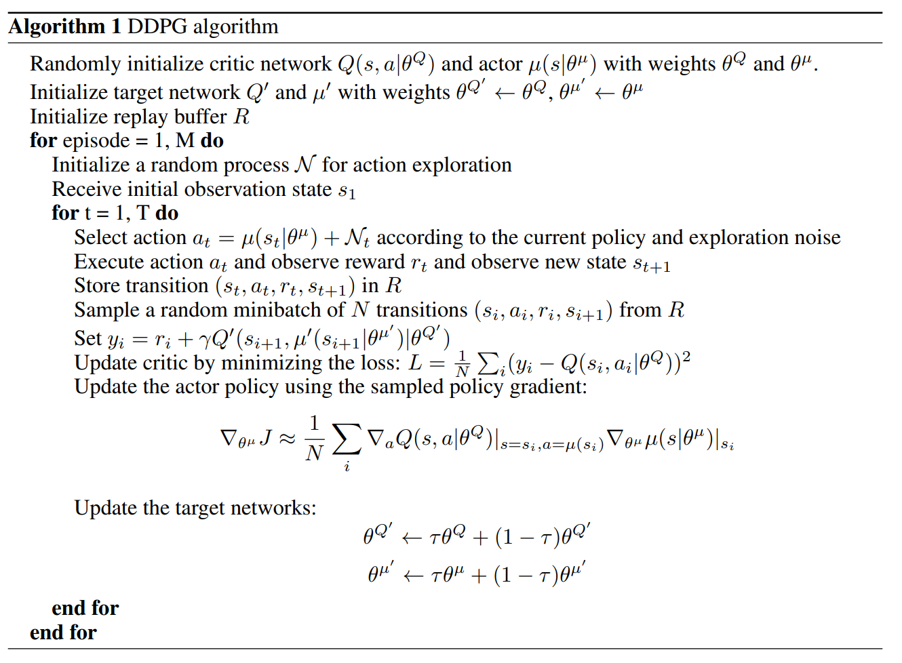
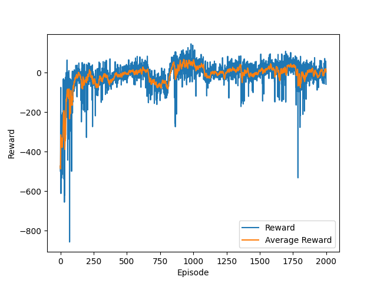

# Deep Deterministic Policy Gradient (DDPG)
- Abgabe: AI Lernziel 3 - Reinforcement Learning
- Paper: https://arxiv.org/pdf/1509.02971.pdf

## Gewählte Umgebung

**Link:** https://gymnasium.farama.org/environments/box2d/lunar_lander/ \
**Beschreibung:** Im Rahmen dieses Projektes wurde sich für die (Box2D-) Umgebung "LunarLanderContinuous-v2" aus der Open-Source Python-Bibliothek Gymnasium entschieden. In dieser muss ein virtuelles Raumfahrzeug so gesteuert werden, dass es sicher auf der Oberfläche des Mondes landet. Die Rakete die es zu steuern gilt besitzt hierbei drei Triebwerke: Links, Rechts und ein Haupttriebwerk (unten). Mit diesen Triebwerken soll die Rakete so gesteuert werden, dass sie in der Landeplattform, welche sich an der Koordinate (0,0) befindet, sicher landet und dabei so wenig Treibstoff wie möglich verbraucht. Grund für die Wahl dieser Umgebung liegt in ihrer relativen Komplexität und gleichzeitig der einfachen Zugänglichkeit für das Training von RL-Agenten. Des Weiteren bietet die Umgebung eine klare und intuitive Zielaufgabe, die es ermöglicht, den Fortschritt des Modells leicht zu verfolgen und zu bewerten. 

**Aktionsraum:** Der Aktionsraum (Action Space) dieser Umgebung ist kontinuierlich. Durch kontinuierliche Aktionen wird der Schub der Triebwerke gesteuert. Der Aktionsraum besteht aus einem 2-dimensionalen Array, wobei die erste Koordinate den Schub des Haupttriebwerks und die zweite Koordinate den Schub der seitlichen Triebwerke festlegt. 

**Observation Space:** Der Zustandsvektor ist ein 8-dimensionaler Vektor, der die Koordinaten der Rakete sowie dessen linearen Geschwindigkeit in x- und y-Richtung, seinen Winkel, seine Winkelgeschwindigkeit und zwei Booleans enthält, die angeben, ob die beiden Beine der Rakete mit dem Boden in Kontakt stehen oder nicht.

**Reward:** In der Umgebung wird nach jedem Schritt eine Belohnung vergeben. Die Gesamtbelohnung einer Episode ist somit die Summe der Belohnungen für alle Schritte innerhalb dieser Episode. Für jeden Schritt wird die Belohnung wie folgt berechnet:

- **Abstand zum Landeplatz:** Je näher/entfernter die Rakete an der Koordinate (0,0) ist, desto höher/niedriger ist die Belohnung.
- **Geschwindigkeit der Rakete:** Je langsamer/schneller sich die Rakete bewegt, desto höher/niedriger ist die Belohnung.
- **Neigung der Rakete:** Die Belohnung verringert sich, wenn die Rakete geneigt ist.
- **Kontakt mit dem Boden:** Die Belohnung erhöht sich um 10 Punkte für jedes Bein, das Kontakt mit dem Boden hat.
- **Seitliche Triebwerke und Haupttriebwerk:** 
  - Die Belohnung verringert sich um 0,03 Punkte für jeden Frame, in dem ein seitliches Triebwerk gezündet wird.
  -  Die Belohnung verringert sich um 0,3 Punkte für jeden Frame, in dem das Haupttriebwerk gezündet wird.

Zusätzlich wird eine Belohnung von $-100$ Punkten gewährt, wenn die Rakete abstürzt, oder $+100$ Punkten, wenn die Rakete sicher landet. 

**Ziel:** Eine Episode gilt dabei als gelöst, wenn in dieser mindestens 200 Punkte erzielt werden konnten.

## Beschreibung relevanter Komponenten des DDPG

Für das Projekt wurde sich für die Wahl des DDPG-Algorithmus entschieden. DDPG ist eine Erweiterung des Deterministic Policy Gradient (DPG)-Algorithmus, der für Umgebungen mit kontinuierlichen Aktionsräumen geeignet ist. Hierbei handelt es sich um einen model-free, off policy actor-critic Algorithmus der Funktionsapproximatoren nutzt, um eine Policy in einem hochdimensionalen, kontinuierlichen Aktionsraum zu erlernen [1]. Im Folgenden wird auf die wesentlichen Komponenten des DDPG eingegangen, die es im Rahmen dieses Projekts zu implementieren galt. 


#### Verwendeter Algorithmus:



DDPG-Algorithmus: [[Quelle]](https://arxiv.org/pdf/1509.02971.pdf)

### Actor-Critic:
Bei dem Actor-Critic-Ansatz handelt es sich um eine hybride Architektur, welche value-based und policy-based Methoden kombiniert, um das Training durch die Reduzierung der Varianz zu stabilisieren. Dabei verwendet es einen Actor $\mu(s|\theta_{\mu})$, welcher kontrolliert wie der Agent sich verhält (policy-based) und einen Critic $Q(s, a)$, welcher misst, wie gut die gewählte Aktion (value-based) ist [2]. Der Actor repräsentiert somit die aktuelle Policy des Agenten und wird durch die Parameter $\theta_{\mu}$ gesteuert, um Zustände (states) auf spezifische Aktionen abzubilden. Mit anderen Worten berechnet der Actor für jeden Zustand $s$ die entsprechende Aktion $\mu(s)$ basierend auf den aktuellen Parametern $\theta_{\mu}$ [1]. Die von mir hierfür implementierte Architektur kann der Abbildung 1 entnommen werden. 

\
Abbildung 1: Implementierte Architektur für das Actor- und Critic-Netzwerk

### Target Networks:
Des Weiteren werden in DDPG analog zum Deep Q-Network (DQN) Zielnetzwerke (target networks) verwendet. Diese werden genutzt, um die Aktualisierung der Policy und der Q-Function zu stabilisieren. Im Gegensatz zum DQN erfolgt die Aktualisierung der Zielnetzwerke jedoch soft und nicht hard [3]. Die Zielnetzwerke stellen hierbei Kopien der eigentlichen Actor- und Critic-Netzwerke dar. 

### Replay Buffer:
Bei der Verwendung von neuronalen Netzen in RL-Algorithmen besteht oftmals die Herausforderung, dass die meisten Optimierungsalgorithmen annehmen, dass die Samples i.i.d. (independently and identically distributed) sind. Werden die Samples jedoch aus der Interaktion mit der Umgebung generiert, gilt diese Annahme nicht mehr. Aus diesem Grund wird in DDPG ein sogenannter Replay Buffer verwendet, um diesem Problem zu entgegnen [1]. Dieser fungiert als ein Zwischenspeicher für Transitions $(s,a,r,s',d)$ und besitzt eine zuvor festgelegte Größe. In jedem Zeitschritt wird der Actor und der Critic aktualisiert, in dem ein zufälliger mini-batch aus dem Zwischenspeicher entnommen wird. Dadurch dass es sich bei DDPG um einen off-policy Algorithmus handelt, wird hierdurch das Lernen durch unkorrelierte Transitions ermöglicht [1]. 

### Exploration-Strategie:

Dadurch dass die gelernte Policy determinisitisch ist, führt der Agent für einen gegebenen Zustand stets dieselbe Aktion aus. Hierdurch wird verhindert, dass der Agent die Umgebung ausreichend erkundet. Aus diesem Grund wird in DDPG ein zusätzliches Rauschen verwendet, um während des Trainings die Erkundung der Aktionen zu fördern. Dies ist von Bedeutung, um einen angemessenen Kompromiss zwischen Exploration (Erkundung neuer Aktionen) und Exploitation (Ausnutzung bekannter, effektiver Aktionen) zu erreichen. In der wissenschaftlichen Arbeit von  Lillicrap et al. (2015) wurde hierfür das Ornstein-Uhlenbeck-Rauschen zu den Aktionsausgaben des Actor-Netzwerks addiert. Im Rahmen dieses Projekts wurde des weiteren auch mit einem Gaußschen Rauschen experimentiert.


## Vorgehensweise
Bei der Umsetzung wurde sich dafür entschieden, zusätzlich eine Hyperparameteroptimierung mittels des Grid-Search-Verfahrens durchzuführen. Hierdurch sollte ein besseres Verständnis für die Auswirkungen der Hyperparameter auf den gewählten Algorithmus gewonnen werden. Insgesamt wurden dabei 16 Parameterkombinationen getestet, deren durchschnittlicher Reward mithilfe von Weights \& Biases protokolliert wurde. Die Trainingsdauer betrug hierbei etwa 10 Stunden. Eine Gegenüberstellung des durchschnittlichen Rewards für jede Parameterkombination ist der Abbildung 2 zu entnehmen. Auf Basis der Erkenntnisse der Hyperparameteroptimierung wurde das Modell weiter angepasst und final trainiert sowie evaluiert.


Abbildung 2: Hyperparameteroptimierung mit Grid-Search 

### Evaluation:
Die durchgeführte Hyperparameteroptimierung hat es ermöglicht, ein Verständnis dafür zu entwickeln, wie sich unterschiedliche Hyperparameter auf die Leistung des Trainingsprozesses auswirken.
Aufgrund begrenzter Rechenressourcen musste jedoch die Durchführung auf einer begrenzten Anzahl zu testender Parameterwerte reduziert werden. Daher konnten letztendlich keine herausragenden Ergebnisse 
mit dem verwendeten RL-Algorithmus erzielt werden. Laut Aufgabenstellung wäre die Problemstellung erfolgreich "gelößt", wenn der Agent es schafft, 200 Punkte in einer Episode zu erzielen. Diese 
wurden im Durchschnitt jedoch nicht erreicht. Letztlich konnte durch die Verwendung eines weniger komplexen Actor- und Critic-Netzwerks (ein Hidden-Layer anstelle von zwei) und die Anpassung der Exploration die Leistung des Modells gegenüber der in der Hyperparameteroptimierung gefundenen Parameterkombination nochmals verbessert werden. 


#### Lernkurve des finalen Agenten:



Abbildung 3: Lernkurve des finalen Agenten

#### Test des finalen Agentens über 10 Episoden hinweg:

    Episode 1 terminated with Reward 41.36
    Episode 2 terminated with Reward 82.59
    Episode 3 terminated with Reward -21.28
    Episode 4 terminated with Reward -41.79
    Episode 5 terminated with Reward 143.54
    Episode 6 terminated with Reward 97.70
    Episode 7 terminated with Reward 84.72
    Episode 8 terminated with Reward 129.09
    Episode 9 terminated with Reward 83.07
    Episode 10 terminated with Reward 149.49

## Limitation

Grundlegend bestand bei der Umsetzung des Projekts die Herausforderung, eine geeignete Balance zwischen Exploration und Exploitation zu finden. Das Rauschen, das für die Exploration verwendet wird, sollte ausreichend sein, um den Agenten zu ermöglichen, neue Aktionen zu erkunden, aber nicht so dominant, dass er keine Zeit hat, aus den bisher gelernten Erfahrungen zu lernen. Eine fein abgestimmte Balance zwischen Exploration und Exploitation war notwendig, um die Performances des Agenten zu verbessern. Nichtdestotrotz sehe ich in der gewählten Umsetzung weiterhin Verbesserungspotenzial, da ich diese Herausforderung nicht vollständig in Griff bekommen habe. Grund hierfür war, dass der Agent teilweise erlernt hatte, möglichst lange in der Luft zu schweben, anstatt die Rakete am Ziel zu landen. Dies könnte der zu niedrigen Exploration geschuldet sein.

## Literaturverzeichnis
**[1]** Lillicrap, T. P., Hunt, J. J., Pritzel, A., Heess, N., Erez, T., Tassa, Y., Silver, D. & Wierstra, D. (2015b). Continuous control with deep reinforcement learning. arXiv (Cornell University). http://export.arxiv.org/pdf/1509.02971

**[2]** Introduction - Hugging Face Deep RL course. (o. D.-b). Abgerufen am 3. August 2023, von https://huggingface.co/learn/deep-rl-course/unit6/introduction

**[3]** Otto, F. (2021). Model-Free Deep Reinforcement Learning—Algorithms and Applications. In Studies in computational intelligence (S. 109–121). https://doi.org/10.1007/978-3-030-41188-6_10

## Verweis auf verwendete Github-Repositorys

**DDPG-Agent:**
 - https://github.com/udacity/deep-reinforcement-learning/blob/master/ddpg-pendulum/ddpg_agent.py

**Replay Buffer:**
- https://github.com/udacity/deep-reinforcement-learning/blob/master/ddpg-pendulum/ddpg_agent.py#L154C1-L189C32

**Exploration-Strategie:**
 - https://github.com/xkiwilabs/Multi-Agent-DDPG-using-PTtorch-and-ML-Agents/blob/82f091bd4266bb444ec9d26cc07ed6486e5dc8f3/OUNoise.py#L11C1-L36C26
 - https://github.com/rail-berkeley/rlkit/blob/master/rlkit/exploration_strategies/ou_strategy.py

## Installation

Zum Installieren der notwendigen Bibliotheken empfehle ich die Verwendung von pipenv:

1. Create virtual environment

   ```
   pipenv shell
   ```
   
2. Install dependencies via

   ```
   pipenv install -r requirements.txt
   ```
   
3. Maybe necessary

   ```
   pipenv install gymnasium[box2d]
   ```
